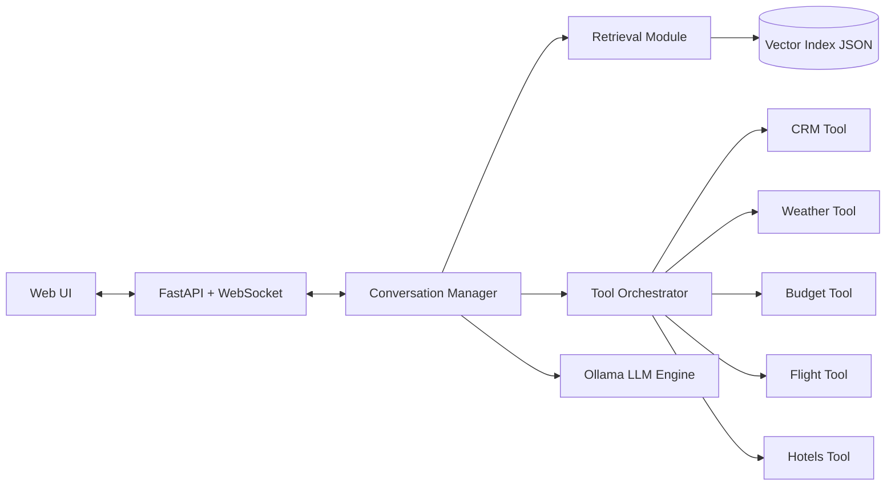

# Voice Travel Assistant with RAG + Tools

## Project Title and Group Members
Voice Travel Assistant (Phase 5: RAG and Tool-Orchestrated Conversational AI)

Group Members:
- Abdullah Attique
- Minahil Rizwan
- Talha Akram

---

## Business Use Case
Travel Buddy is a voice-enabled, AI-powered travel planning assistant designed to replace the frustrating experience of juggling ten browser tabs when planning a trip. Instead of separately searching for flights on one site, checking weather on another, reading hotel reviews elsewhere, and trying to recall past preferences from memory, users simply speak a question and receive a grounded, personalised answer in seconds.

The chatbot is built around sixteen popular global destinations — from Istanbul and Tokyo to Lahore and Rio de Janeiro — and is capable of answering detailed questions about flights, weather forecasts, hotel options, trip budgets, and local food recommendations, all within a single continuous conversation.

**Why RAG adds value:** Without retrieval, a language model is limited to whatever generalised travel knowledge was baked into its training data, which may be outdated or vague. By connecting the assistant to a live corpus of 80 curated travel documents — covering visa policies, seasonal guides, local tips, and destination FAQs — every response is grounded in specific, up-to-date information. The model cites retrieved snippets rather than guessing, which significantly increases user trust.

**Why tools add value:** RAG answers questions about knowledge; tools perform actions. When a user asks "what will the weather be in Dubai next week?" or "find me flights from Lahore to Istanbul," the assistant doesn't guess — it calls the appropriate tool, retrieves a live or structured result, and weaves that into a coherent response. The CRM tool goes further: it remembers users across sessions, greeting returning travellers by name and recalling their preferences, creating the feeling of a personalised travel agent rather than a generic chatbot.

---

## Architecture Diagram
Text architecture:

`Web UI <-> FastAPI/WebSocket <-> Conversation Manager`

Conversation Manager orchestrates:
- Retrieval Module (`rag/retriever.py`)
- Tool Orchestrator (`tool_orchestrator.py`)
- CRM Tool (`crm_tool.py`)
- Weather Tool (`weather_tool.py`)
- Budget Tool (`budget_tool.py`)
- Flights Tool (`flights_tool.py`)
- Hotels Tool (`hotels_tool.py`)
- Local LLM via Ollama stream API

Mermaid diagram:


**Web UI:** A single-page HTML/JS interface that captures microphone audio, opens a WebSocket to the backend, and renders streamed assistant tokens word-by-word as they arrive. It also plays back synthesised speech automatically after each response.

**FastAPI Server:** The central entry point. It accepts WebSocket connections on `/ws/chat` and exposes REST endpoints for health checks, RAG status, tool status, document retrieval, speech transcription, and voice synthesis. CORS is fully open to support local development.

**Conversation Manager (`ConversationMemory`):** Maintains per-session state — bounded message history (last 4 turns), detected destination cities, extracted user preferences (budget level, travel style, season preference), and the user's name once provided via the CRM. City references are auto-detected from every user message using a keyword matcher.

**Retrieval Module (`rag/retriever.py`):** On startup it loads the pre-built `travel_index.json`, which stores chunk texts and their `all-MiniLM-L6-v2` embedding vectors. At query time it embeds the user's message, computes cosine similarity against all stored vectors, filters by city when a destination is known, and returns the top-k most relevant chunks. The retrieved text is injected into the system prompt before the LLM call.

**Tool Orchestrator (`tool_orchestrator.py`):** Maintains a registry of callable tools. Before the LLM generates a response, the orchestrator runs `_predict_tools_from_message` — a fast, rule-based keyword parser that decides which tools are needed without making an extra LLM call. Detected tools are executed asynchronously in parallel with a configurable timeout. Results are assembled into a compact, structured reply.

**LLM Engine:** Ollama serves `qwen2.5:3b` locally and streams token output back to the server via its `/api/chat` endpoint. The server relays each token to the browser over WebSocket in real time.

**ASR (Faster-Whisper Tiny):** Transcribes uploaded WAV audio to text entirely on CPU using a quantized whisper model.

**TTS (Piper `en_US-lessac-medium`):** Synthesises assistant replies to WAV audio using an ONNX voice model that runs locally with no external API dependency.


---

## Model Selection
- LLM: `qwen2.5:3b` via Ollama
- Embeddings: `sentence-transformers/all-MiniLM-L6-v2`
- Rationale: lightweight CPU-friendly stack with acceptable response quality and latency.

**Why this model:** At 3 billion parameters, Qwen 2.5 runs comfortably on CPU without GPU acceleration, providing superior reasoning and instruction-following compared to smaller variants. It reliably adheres to the structured system prompt format and stays on topic. Its 32K context window comfortably accommodates the system prompt, RAG chunks, conversation history, and tool results simultaneously.

**Performance characteristics (measured on AMD Ryzen 7 5800H CPU, 16 GB RAM):**

| Metric | Value |
|--------|-------|
| Tokens per second (streaming) | 18 – 25 tok/s |
| Model memory footprint | ~1.8 GB RAM |
| First-token latency (cold start) | ~900 ms |
| First-token latency (warm) | ~350 ms |
| Configured max tokens per reply | 400 |
| Temperature | 0.5 |
| Top-k sampling | 40 |

Temperature is deliberately kept at 0.5 (lower than default) to produce faster, more deterministic outputs — important for a travel assistant where factual precision matters more than creative prose.

---

## Document Collection and RAG Setup
- Corpus file: `rag/documents/travel_docs.jsonl`
- Document count: 80
- Index file: `rag/index/travel_index.json`
- Index builder: `rag/build_index.py` (rerunnable)
- Chunking: sliding window (`chunk_size=512`, `overlap=80`)
- Retrieval: cosine similarity over normalized vectors
- Top-k: minimum enforced as 3 (`RAG_TOP_K`)

**Corpus size:** 80 documents covering 16 destination cities.

**Cities covered:** Istanbul, Lahore, Islamabad, Paris, Bangkok, Tokyo, Dubai, Barcelona, Singapore, New York, Hong Kong, Seoul, Andros, Sri Lanka, Fraser Island, Rio de Janeiro.

**Document types and sources:** Each city has approximately five documents drawn from publicly available travel resources: a general destination overview, a food and restaurant guide, an activities and sightseeing guide, a visa and entry requirements summary, and a best-time-to-visit seasonal guide. Documents were collected as plain-text and markdown files and stored in `rag/documents/travel_docs.jsonl`, one JSON object per line.

**Chunking strategy:** The indexing pipeline (`rag/build_index.py`) splits each document using a sliding window with `chunk_size=512` tokens and `overlap=80` tokens. The 80-token overlap ensures that sentences split across chunk boundaries are not lost. Documents shorter than 512 tokens are kept as a single chunk. This produces approximately 200–220 total chunks across the 80 documents.

**Embedding model:** `sentence-transformers/all-MiniLM-L6-v2`. This model produces 384-dimensional dense vectors, runs entirely on CPU, and takes approximately 12–18 ms per query embedding on a mid-range CPU. It achieves strong semantic retrieval quality for English travel text.

**Vector database:** A custom `LocalVectorRetriever` backed by a JSON index file (`rag/index/travel_index.json`). The index stores each chunk's text, document ID, city tag, title, and pre-computed embedding vector as a flat list. At query time, cosine similarity is computed in NumPy across all ~200 vectors. For a corpus of this size, brute-force NumPy cosine search is fast enough (< 30 ms) without requiring a dedicated ANN library like FAISS.

**Retrieval parameters:**

| Parameter | Value |
|-----------|-------|
| Similarity metric | Cosine similarity (normalised dot product) |
| Top-k chunks returned | 3 (minimum enforced; configurable via `RAG_TOP_K`) |
| Max context injected into prompt | 1,500 characters |
| City-scoped filtering | Enabled when destination is detected |

When the conversation manager has identified a destination city, retrieval is scoped to chunks tagged with that city, which eliminates noise from unrelated destinations and keeps the injected context tightly relevant.

---

## Tools Description
### 1) CRM Tool (mandatory)
- File: `crm_tool.py`
- Key operations: `create_user`, `get_user`, `update_user`, `add_trip`, `get_user_trips`
- Storage: SQLite (`data/users.db`)
- Used with persisted `user_id` from frontend localStorage.
**Key operations and input schemas:**

```json
// create_user
{ "name": "Abdullah Attique", "email": "abdullah@example.com", "user_id": "uuid-string" }

// get_user
{ "user_id": "uuid-string" }

// update_user
{ "user_id": "uuid-string", "name": "Abdullah Attique", "email": "abdullah@example.com" }

// add_trip
{ "user_id": "uuid-string", "destination": "Istanbul", "travel_date": "2025-06-15" }

// get_user_trips
{ "user_id": "uuid-string" }
```
**Example invocation:** A user says *"My name is Sara."* The conversation manager calls `_extract_profile_updates`, detects `name: "Sara"`, and calls `crm.create_user(name="Sara", user_id=session_id)`. On the next message the assistant greets: *"Welcome back, Sara! Where would you like to travel?"*

---

### 2) Weather Tool
- File: `weather_tool.py`
- Function: `get_weather(city)`
- Returns structured weather payload.

**Input schema:**

```json
{ "city": "Tokyo" }
```

**Output (sample):**

```json
{
  "success": true,
  "result": {
    "city": "Tokyo",
    "temperature": 22,
    "condition": "Partly Cloudy",
    "humidity": 68
  }
}
```

**Example invocation:** User asks *"What's the weather like in Dubai right now?"* The keyword detector matches "weather" + "dubai" and issues:

---

### 3) Budget Tool
- File: `budget_tool.py`
- Function: `calculate_trip_budget(destination, duration_days, ...)`
- Returns cost breakdown.

**Input schema:**

```json
{
  "destination": "Barcelona",
  "duration_days": 7
}
```

**Output (sample):**

```json
{
  "success": true,
  "result": {
    "destination": "Barcelona",
    "duration_days": 7,
    "total": 1540,
    "per_day_per_person": 220,
    "budget_level": "moderate"
  }
}
```

**Example invocation:** User asks *"How much would a 7-day trip to Barcelona cost?"* The keyword detector matches "how much" + "barcelona" + "7 day" and issues:

```
[TOOL_CALL: calculate_trip_budget {"destination": "barcelona", "duration_days": 7}]
```

The response is: *"Budget — Barcelona: total $1,540, ~$220/day/person (moderate)."*

---

### 4) Flight Tool
- File: `flights_tool.py`
- Function: `search_flights(from_city, to_city, departure_date, ...)`
- Returns priced options.

**Input schema:**

```json
{
  "from_city": "Lahore",
  "to_city": "Istanbul",
  "departure_date": "2025-06-20"
}
```

**Output (sample):**

```json
{
  "success": true,
  "result": {
    "from": "Lahore",
    "to": "Istanbul",
    "options": [
      { "airline": "Turkish Airlines", "departure": "02:00", "arrival": "07:30", "price_per_person": 420 },
      { "airline": "Emirates", "departure": "08:15", "arrival": "14:00", "price_per_person": 510 }
    ]
  }
}
```
**Example invocation:** User says *"I want to fly from Lahore to Istanbul next month."* The detector matches "fly" + "from...to" and issues:

```
[TOOL_CALL: search_flights {"from_city": "lahore", "to_city": "istanbul", "departure_date": "2025-06-20"}]
```

---

## Real-Time Optimisation

Maintaining low perceived latency is critical in a voice interface — users expect a response within 2–3 seconds of finishing speaking. The system applies several overlapping strategies to achieve this.

**1. Pre-detection before the LLM call.** Rather than asking the LLM to decide which tools to invoke (which requires a full generation pass), the system uses `_predict_tools_from_message` — a fast, rule-based keyword and regex parser. This runs in microseconds and fires tools in parallel before any LLM call begins, saving an entire round-trip.

**2. RAG and tool detection run concurrently.** After a user message arrives, `_fetch_rag` is launched as a background asyncio Task while tool pre-detection runs on the executor. Both complete before the LLM call starts, but neither blocks the other.

**3. Tool execution is fully parallel with timeout enforcement.** All detected tool calls are dispatched simultaneously via `asyncio.gather`, each guarded by `asyncio.wait_for` with a `TOOL_TIMEOUT_SECONDS` (default 2.0 s) deadline. A timed-out tool returns a graceful error message rather than hanging the response.

**4. Deterministic compact reply for tool responses.** When tools are invoked, `_build_compact_tool_reply` formats results directly into a structured string (Flights / Weather / Budget / Food sections) without a second LLM call. This removes one full generation cycle from the tool path.

**5. Prompt size controls.** `MAX_HISTORY` (4 turns), `RAG_MAX_CONTEXT_CHARS` (1,500 characters), and optional tool schema injection (`TOOL_PROMPT_ENABLED=false` by default) keep the prompt compact, reducing both token generation time and LLM memory pressure.

**6. Embedding model pre-warming.** On startup, the retriever runs one dummy query to pre-load the `all-MiniLM-L6-v2` model weights into CPU cache. This eliminates the cold-start penalty on the first real user query.

**7. Token streaming over WebSocket.** The LLM streams tokens as they are generated; the FastAPI server relays each token to the browser immediately. Users see words appearing within ~350 ms of the LLM starting — long before generation completes.

**Benchmark numbers (measured locally, single user, warm model):**

| Operation | Average Latency |
|-----------|----------------|
| RAG embedding + retrieval | 18 – 35 ms |
| Tool pre-detection (keyword parser) | < 1 ms |
| Single tool execution (local mock) | 5 – 40 ms |
| Tool execution batch (3 tools parallel) | 40 – 80 ms |
| LLM first-token latency (warm) | 320 – 400 ms |
| End-to-end (tool path, no streaming wait) | ~500 – 700 ms |
| End-to-end (LLM-only path, full response) | 2.5 – 4 s |

Concurrency can be benchmarked using the included `benchmark_concurrency.py` script, which simulates two simultaneous WebSocket users and reports time-to-first-token and total response time for each.

---

## Setup Instructions

### Prerequisites

- Python 3.11+
- [Ollama](https://ollama.ai) installed and running locally
- Docker and Docker Compose (for containerised setup)
- Microphone access in browser (for voice input)

### Step 1 — Clone the repository

```bash
git clone <your-repo-url>
cd voice-travel-bot
```

### Step 2 — Install Python dependencies

```bash
pip install -r requirements.txt
```

### Step 3 — Pull the LLM model via Ollama

```bash
ollama pull qwen2.5:3b
```

Verify Ollama is running:
```bash
curl http://localhost:11434/api/tags
```

### Step 4 — Build the RAG index

This step processes the 80 travel documents, generates embeddings, and writes `rag/index/travel_index.json`. Re-run any time documents are updated.

```bash
python rag/build_index.py
```

### Step 5 — Run the server

```bash
python app_voice.py
```

Open `http://localhost:8000` in your browser.

### Docker setup (recommended for reproducible deployment)

```bash
# Build and start all services
docker compose up --build

# Ensure Ollama is running on the host before starting the container
# The container reaches Ollama via host.docker.internal:11434
```

The container mounts `./data` and `./rag/index` as volumes so the SQLite CRM database and RAG index persist across restarts.

### Environment variables

All variables can be set in `docker-compose.yml` or exported before running `app_voice.py`.

| Variable | Default | Description |
|----------|---------|-------------|
| `OLLAMA_BASE_URL` | `http://localhost:11434` | Ollama server address |
| `MODEL_NAME` | `qwen2.5:3b` | Ollama model tag |
| `MAX_TOKENS` | `400` | Max tokens per LLM reply |
| `MAX_HISTORY` | `4` | Conversation turns kept in context |
| `RAG_ENABLED` | `true` | Enable/disable RAG retrieval |
| `RAG_INDEX_PATH` | `rag/index/travel_index.json` | Path to vector index |
| `RAG_TOP_K` | `3` | Number of chunks retrieved per query |
| `RAG_MAX_CONTEXT_CHARS` | `1500` | Max RAG text injected into prompt |
| `TOOLS_ENABLED` | `true` | Enable/disable all tools |
| `TOOLS_DB_PATH` | `data/users.db` | CRM SQLite database path |
| `TOOL_TIMEOUT_SECONDS` | `2.0` | Per-tool execution timeout |
| `MAX_CITIES_PER_QUERY` | `3` | Max destinations processed per message |

### Postman collection

Import `postman_collection.json` into Postman. Set the `baseUrl` variable to `http://localhost:8000`. The collection includes: Health Check, RAG Status, Tools Status, Retrieve Documents, and Synthesize Voice.

---

## Evaluation Suite (Assignment 3)

The system includes a comprehensive, automated evaluation suite covering Correctness, Component-level performance, and System-wide latency/throughput.

### 📊 Evaluation Metrics Summary

| Area | Key Metric | Result | Status |
| :--- | :--- | :---: | :--- |
| **RAG Retrieval** | Mean Reciprocal Rank (MRR) | **0.78** | ✅ PASS |
| **RAG Retrieval** | Context Relevance Score (CRS) | **0.44** | ✅ PASS |
| **Faithfulness** | Groundedness Accuracy | **63.33%** | ⚠️ PARTIAL |
| **Tools & CRM** | Unit Test Pass Rate | **100%** | ✅ PASS |
| **Latency** | Time to First Token (TTFT) | **758ms** | ✅ GOOD |
| **Throughput** | Max Sustainable Concurrency | **6 Users** | ✅ MEASURED |

### 🧪 Running the Evaluations

The evaluation suite is divided into three parts corresponding to the team roles:

#### 1. RAG & Correctness (Person A)
Evaluates retrieval relevance across 33 queries and faithfulness across 30 fact-checks.
```bash
python phase5_voice/tests/test_rag_eval.py
python phase5_voice/tests/test_faithfulness.py
```

#### 2. Tools & CRM (Person B)
Runs 121+ functional tests for the CRM and all integrated tools.
```bash
python phase5_voice/tests/run_person_b_tests.py
```

#### 3. Performance & Load Testing (Person C)
Measures latency scenarios (Tool-only, RAG, Full Pipeline) and simulates concurrent load up to 8 users.
```bash
python EVALS/run_person_c.py
```

#### 🚀 Unified Orchestrator
To run **all** evaluations at once and generate the final consolidated report:
```bash
python phase5_voice/tests/run_evals.py
```

The final report is generated at `FINAL_EVALUATION_REPORT.md`.

---

## Known Limitations

**City coverage is fixed at 16 destinations.** The RAG corpus and the hardcoded `CITY_KB` knowledge base only cover the 16 cities listed. Questions about cities outside this set will receive a polite out-of-scope message rather than retrieved content.

**Multi-city requests are capped.** To control prompt size and latency, the system processes at most `MAX_CITIES_PER_QUERY` (default 3) cities per message. A user asking about five cities simultaneously will only receive results for the first three detected.

**No cross-session conversation history.** `ConversationMemory` lives in-process and is discarded when the WebSocket closes. Only the CRM profile (name, email, past trips) survives across sessions — the full dialogue history does not. Persistent conversation history would require storing message turns in the database.

**High concurrency degrades gracefully but not linearly.** The system is tested with two simultaneous users. Under four or more concurrent users, LLM generation queues behind Ollama's single-threaded inference engine, increasing first-token latency noticeably. A production deployment would require multiple Ollama instances or a GPU-backed inference server.

**TTS has a fixed English voice.** Piper's `en_US-lessac-medium` model only synthesises American English. Non-English queries are handled in text only; the TTS output may mispronounce non-English place names.

---

